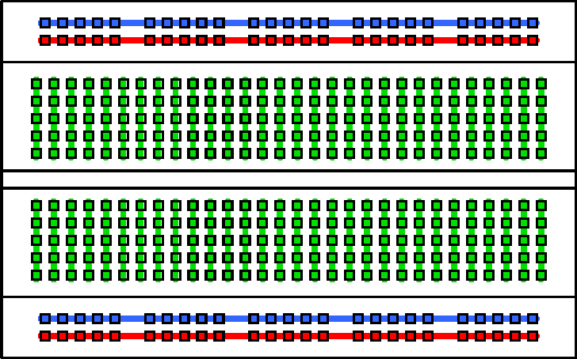
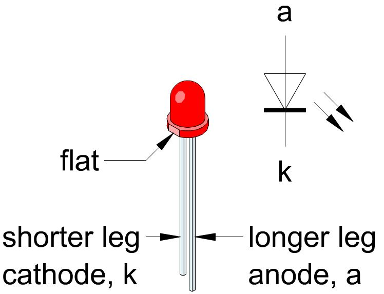
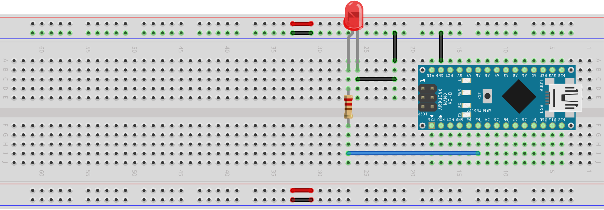

# 2. Arduino for Data Collection

[Arduino](https://www.arduino.cc) is a platform of [microcontrollers](https://en.wikipedia.org/wiki/Microcontroller) that has a large user-base, and that is easy to work with. These microcontrollers are programmed in a language developed for the Arduino boards, which is closely related to the programming language called [C](https://en.wikipedia.org/wiki/C_(programming_language)). Learning two programming languages at once is not easy, so we have already uploaded code on the boards so that you can control it by sending it commands from Python.

To communicate with the microcontroller, you will be using a [serialized communication](https://en.wikipedia.org/wiki/Serial_communication) method simply known as Serial. It encodes the information you want to send into a sequence of bits (zeros and ones). These bits are sent over one wire from your computer to the Arduino, and over another wire from the Arduino to your computer so that both units can talk to each other. A third wire, known as gound, provides a common refference to these two data lines.

Python has libraries that know how to decode information and send it over this serial link so that we do not need to know anything about how it is implemented. One of these libraries is called Arduino-Python.

## Installing Arduino-Python
Arduino-Python is not available through the package manager in Anaconda. We, therefore, need to use _pip_, which is another package manager
 - Go to Anaconda and select the environments tab.
 - Click the play button next to the Python environment you set up earlier.
 - Click "Open Terminal".
 - Type `pip install arduino-python` followed by return.
 - The library should now be installed. Quit the Terminal/Command Line window, and return to Spyder.

## Connecting an LED to the microcontroller
### Breadboard
The breadboard is a very useful tool for prototyping. It allows us to connect components into circuits without soldering reliably. The internals of a breadboard is connected as shown in the image below. It is usual to use the horizontal traces on the side of the board as power (red) and ground (blue). For large breadboards, the power and ground rails may be split in the middle.



### LED
Light emitting diodes are very useful devices for outputting light. Being diodes, they have a polarity. They only admit current to pass one way, from the anode to the cathode. You can see which side is the cathode by finding the side with a flat notch and shorter leg.

It is also important to ensure that the voltage across the diode does not exceed what it can withstand without overheating. LEDs typically have a forward voltage drop of between 1.8V and 3.3V and consume about 20mA during normal operation. Thus, as we want to drive them from 5V pins, we need to use a current limiting resistor in series with the diode. This resistor should be around 100 to 500 ohms.



### Arduino Pins
The Arduino Nano as many pins that each can be configured to perform some action. Not all pins are equal. The function of each is written on the board for convenience. The most important ones are the following:
- GND means the pin is connected to the ground voltage level of the microcontroller.
- Vin means 5V, as that is the voltage we are powering the microcontroller with.
- D followed by a number (such as D13) signifies a digital pin. These pins can be configured to output LOW (0V) or HIGH (5V). They can also be used to read if the voltage applied to the pin is HIGH or LOW.
- A followed by a number (such as A2) are analog pins. In addition to being used as digital pins, they are capable of reading any voltage between 0V and 5V.


### Circuit
We are ready to connect the circuit below. Connect a 100 ohm to 500 ohm resistor in series with the LED. This is to limit the current moving through the LED so that it does not overheat and get damanged.

Make sure to connect the cathode of the diode to ground. The cathode is the side with the shortest leg and with a small flat notch on the diode housing.

Notice that we are connecting the LED to pin D13. This will be important in the next step when we want to control this pin.



## Programming
Now, you can control the Arduino by typing the following lines of code into Spyder. After starting the program, some seconds may pass, but then the LED should start flashing rapidly.

```python
# import libraries
from Arduino import Arduino
import time

board = Arduino('9600')       # find and connect microcontroller
print('Connected')            # confirms the microcontroller has been found
board.pinMode(13, "OUTPUT")   # configure pin 13 to be an output pin

# enter infinite loop
while True:
    board.digitalWrite(13, "LOW")   # set pin low (0V)
    time.sleep(1)                   # wait 1 second
    board.digitalWrite(13, "HIGH")  # set pin high (5V)
    time.sleep(1)                   # wait 1 second
```

If it does not work, it might be because the computer is not automatically able to determine which USB port the Arduino is plugged into. Go to system settings to find the name of the port and change line 3 to `board = Arduino('9600', port='PORT_NAME')` where PORT_NAME is replaced by the port name that the Arduino is connected to on your computer. On a Windows machine, the port name is typical `COM3` or something similar, whereas on a Mac the port name typically will look like `/dev/tty.usbmodem143201`.


## RBG LED
We are now ready to look at an RGB LED. This is a device that contains both a red, green and blue LED in one package. Contorlling the relative brigtness of the different color-channels will enable us to display just about any color, making this a very cool decvice to play with.

In order to be able to set the brightness of each pin, we will use the analog pins (marked with A folloed by a number) on the Arduino. These pins are able to output any voltage between 0V and 3.3V. We will later learn more about this feature.


Connect the LED as shown below. You will not be able to control the color of the led as follows:
TODO: Check example

```python
# import libraries
from Arduino import Arduino
import time

board = Arduino('9600')       # find and connect microcontroller
print('Connected')            # confirms the microcontroller has been found

# give pins names so they are easy to refference
RED   = A0
GREEN = A1
BLUE  = A2

# configure A0, A1 and A2 as output pins
board.pinMode(RED, "OUTPUT")
board.pinMode(GREEN, "OUTPUT")
board.pinMode(BLUE, "OUTPUT")

while True:
    board.analogWrite(RED, 255)     # set RED to full brightness (3.3V)
    time.sleep(1)                   # wait 1 second

    board.analogWrite(RED, 0)       # turn RED off
    board.analogWrite(GREEN, 255)   # set GREEN to full brightness (3.3V)
    time.sleep(1)                   # wait 1 second

    board.analogWrite(GREEN, 0)       # turn RED off
    board.analogWrite(BLUE, 255)   # set GREEN to full brightness (3.3V)
    time.sleep(1)                   # wait 1 second
```

You can now modify the code to do what you want. Can you make the LED be yellow? What about making the color of the LED change gradualy?


## The Arduino-Python Library
The source for the Arduino-Python library can be found [here](https://github.com/thearn/Python-Arduino-Command-API). This repository includes a description of features and the source code that you can have a look at to figure out what other functions you can use with the Arduino board. In the next module, we will use the `pulseIn_set` function to measure the distance to objects using an ultrasonic range finder.

Next section: [Ultrasonic Range Sensing](/3.%20Ultrasonic%20Range%20Sensing/)
