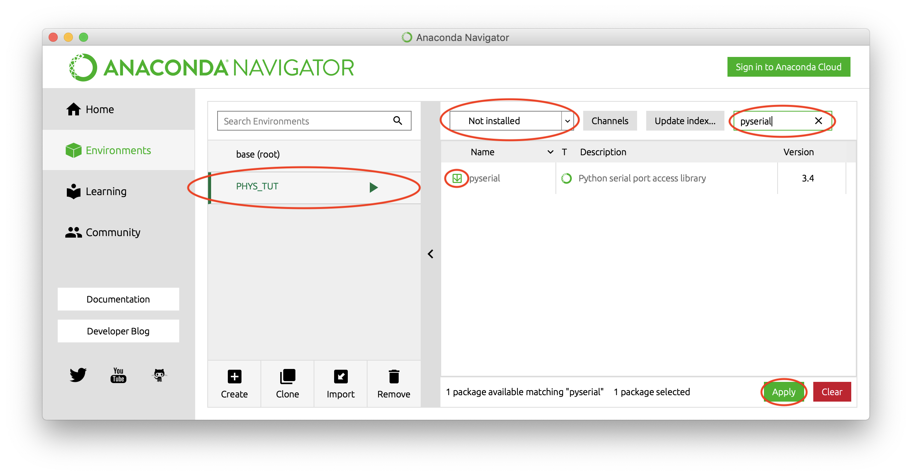

# UBC_PHYS_Python-crash-course
A practical guide to using python in science developed by UBC Physics and Astronomy.

# Instructions

## Installing Anaconda
Anaconda is a package manager (program that helps you install all the things you need, and that keeps it organised) which is made for Python. To install Anaconda, do the following:

- Download the "Python 3.7 version" installer suitable for your operating system from https://www.anaconda.com/download/
- Run the installer.
- Follow the prompt to install Visual Studio Code (cross-platform code editor with excellent support for Python.

## Setting up a virtual environment
Different projects might need to use different versions of Python. We will therefore set up "virtual environments" every time we want to run Python code, to make sure we are interfacing with the packages and installations we want.
- Launch Anaconda (you will find Anaconda in launchpad (Mac) or your start menu (Windows)).
- Go to the "Environments" tab on the left hand side of the screen.
- Click "Create". The dialogue seen in this figure will appear:

- Give the environment a name of your choosing (for example "PHYS_TUT").
- Select the check-box for Python and select 2.7 from the dropdown. This is the version of Python we are going to use.
- Ensure R is unchecked.
- Hit "Create".

You have now made your own environment. It may appear below your "base (root)" environment which is the global environment on your computer.

We can now install the packages we need in our newly made environment. Do as follows:
- Ensure the environment we just created is active. If not, simply click on it to activate it. Changing environemnts can take some seconds, so be patient.

- Select "Not installed" from the dropdown and search for "pyserial". When it appears, select the checkbox for the package and hit "Apply".

- Select "Apply" in the dialogue and wait til the package is installed.

## Getting started with Spyder
In order to write Python code, it is nice to have a text editor that knows Python and can provide us with some useful features. Anaconda has an option built in. You can open it by going to the tab "Home" and launching "Spyder".

## Writing Python
## Running Python
## Running code to interface with microprocessor
