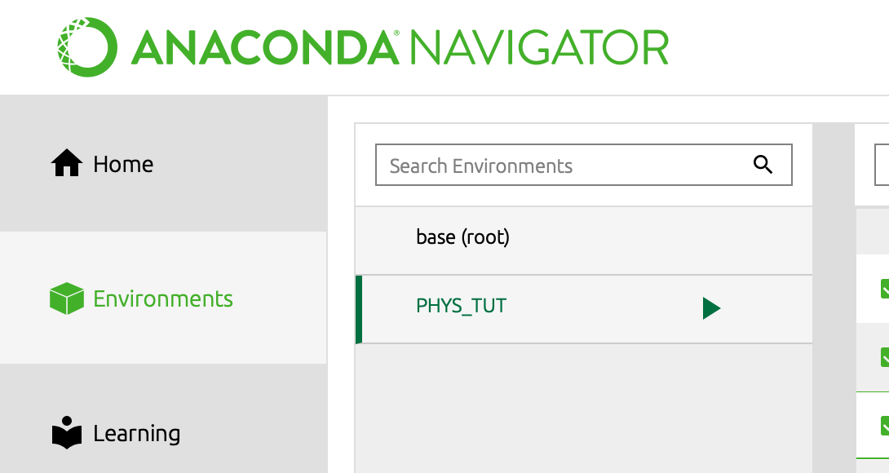
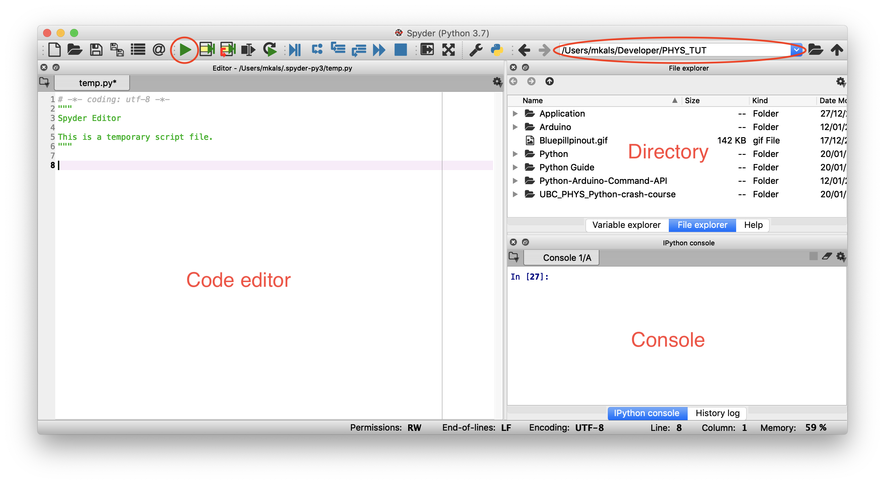

# Python Cash Course
A practical guide to using python in science developed by UBC Physics and Astronomy.

# Instructions

## Installing Anaconda
Anaconda is a package manager (program that helps you install all the things you need, and that keeps it organised) which is made for Python. To install Anaconda, do the following:

- Download the "Python 3.7 version" installer suitable for your operating system from https://www.anaconda.com/download/
- Run the installer.
- You will get a prompt to install Visual Studio Code. We do not need this text editor for this course, so you do not need to download it.

## Setting up a virtual environment
Different projects might need to use different versions of Python. We will, therefore, set up "virtual environments" every time we want to run Python code, to make sure we are interfacing with the packages and installations we want.
- Launch Anaconda (you will find Anaconda in launchpad (Mac) or your start menu (Windows)).
- Go to the "Environments" tab on the left-hand side of the screen.
- Click "Create". The dialogue seen in this figure will appear:

- Give the environment a name of your choosing (for example "PHYS_TUT").
- Select the check-box for Python and select 2.7 from the dropdown. This is the version of Python we are going to use.
- Ensure R is unchecked.
- Hit "Create".

You have now made your own environment. It may appear below your "base (root)" environment which is the global environment on your computer.

We can now install the packages we need in our newly made environment. Do as follows:
- Ensure the environment we just created is active. If not, simply click on it to activate it. Changing environments can take some seconds, so be patient.

- Select "Not installed" from the dropdown and search for "pyserial". When it appears, select the checkbox for the package and hit "Apply".

- Select "Apply" in the dialogue and wait until the package is installed.
- Repeat these steps to install another package called "numpy". It has some dependencies that will be automatically installed.

## Getting started with Spyder
Spyder is a scientific Python development environment that makes it easy to write and run Python code. You can install it from within Anaconda as follows:
- Go to the "Home" tab on the upper left side of the Anaconda window.
- Find Spyder and click "Install". Wait until the installation is completed.

To start working with Spyder, do the following:
- Ensure the "Applications on" dropdown is set to the environment "PHYS_TUT" that we just created.
- Hit "Launch" on Spyder.
- You are now greeted with the Spyder interface. It consists of three parts:
  - Code editor: where you write your Python code
  - Directory: where you store and access your files
  - Console: where you run and view the output from your code

- After you have written some code you want to run, click the green play button at the top of the screen.
- Set the directory path (circled in the picture above) to where you want your code to be saved.

## Writing Python
A great resource for learning Python can be found [here](https://docs.python.org/2/tutorial/index.html).

### Using python as a calculator
The easiest thing you can do is use python as a calculator. You can for example write `2+2.5` or `2+10-5*10/2` and hit return on your keyboard to make Python compute the result.

TODO: Order of operations?

### Comments
The Python interpreter will skip anything that comes after `#` on a line. You can use this to write notes about what you are doing in your code, which can be useful for human beings to read to understand what is going on. For example
```python
2**6 # is the python notation for exponentiation, ie. 2^6
```

### Assigning variables
You can define variables by setting them equal to something:
```python
a = 1
b = 2
a+b # will now be equvalent to saying 1+2
```

You can update the value a variable contains by setting it equal to something else:
```python
a = 1
a = 2
a # will now be equal to 2, not 1
```

### Strings
You can also set variables to be equal to text. For this to work, you need to surround the text with quotation-marks:
```python
a = "this is a string"
b = " and this is another"
a+b #  "this is a string and this is another"
```

substrings and searching in strings

### Lists
initialization and indexing

### `If` statements
### `While` loops
### `For` loops
### Functions
### Classes?


## Interfacing with microcontroller
These are instructions for using the serial interface etc.


## What to bring?
- Computer with Anaconda installed. Must provide instrucitons for installing Anaconda in this case. Download is about 650MB, so can take a bit of time on _UBC visitor_.

## What to ask of prior experience
- New to programming? Most important!
- New to Arduino?
